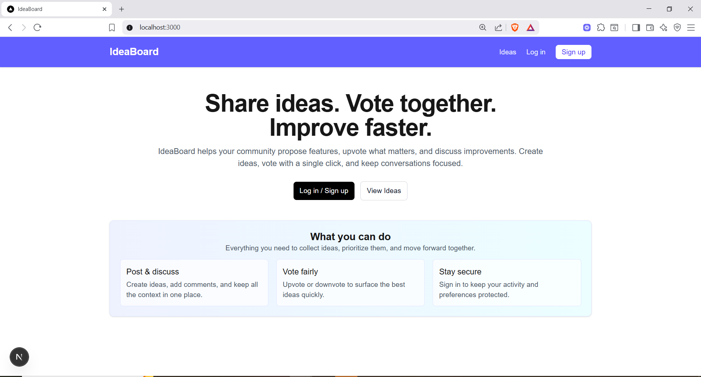
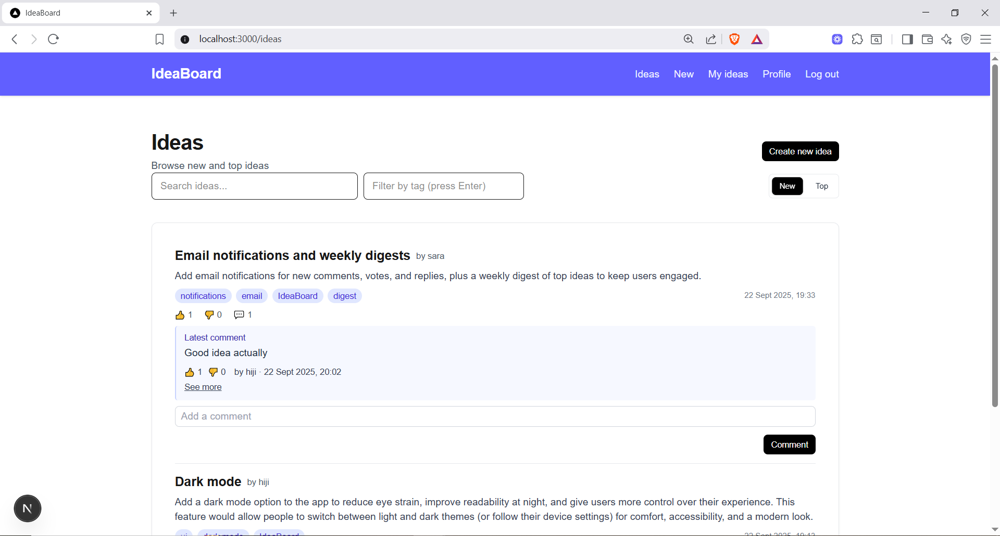
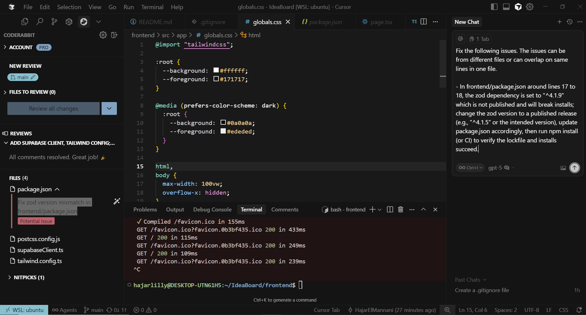
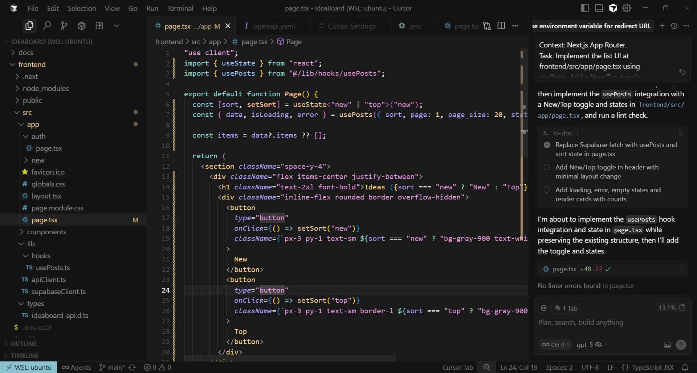
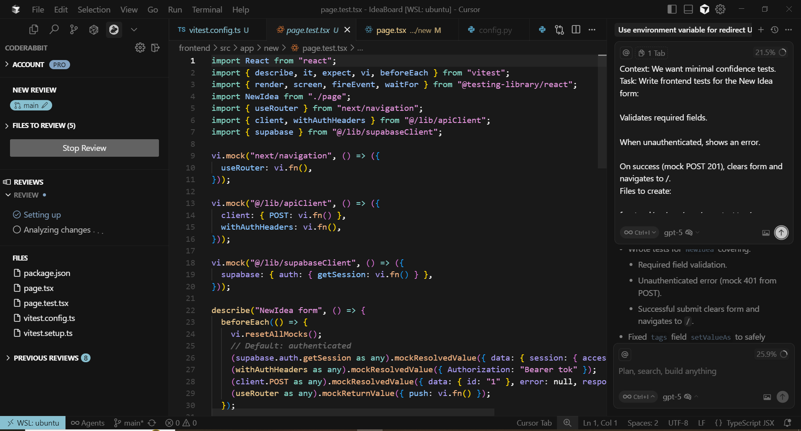
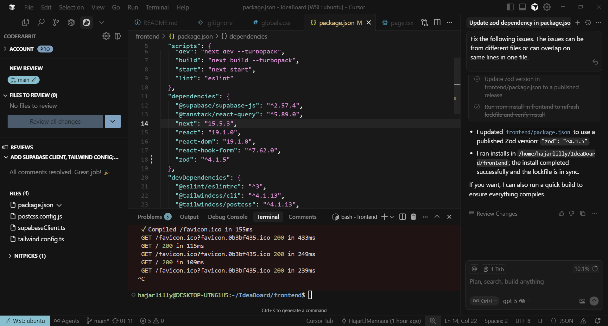

# IdeaBoard

IdeaBoard is a lightweight community feedback and idea‑voting platform. It lets teams collect ideas, allow the community to vote and comment, and prioritize features in a transparent way.

---

## ✨ Features
- Idea feed with tabs: Newest and Top (`/ideas`)
- Search and tag filtering (persisted via URL params `q`, `tag`)
- Idea submission with title, description, and tags (`/ideas/new`)
- Idea detail with comments and voting (`/ideas/[id]`)
- Voting on ideas and comments (up/down; toggle to remove your vote)
- Email/password auth (Supabase) and session persistence
- Profile page to edit username (`/profile`)
- "My ideas" dashboard with per‑idea comment sorting

---

## 🧰 Tech Stack
- Next.js 15.5.3, React 19.1.0, TypeScript 5
- Supabase JS `@supabase/supabase-js` 2.57.x (Auth, Postgres)
- TailwindCSS 4
- ESLint 9

Directory layout:
- `frontend/` — Next.js app (routes under `app/`), UI components, hooks, Supabase client

---

## 🚀 Setup & Run

### Prerequisites
- Node.js 18+ and pnpm/yarn/npm
- Supabase project (URL and anon key)

### Environment
Create a `.env.local` in `frontend/`:

```
NEXT_PUBLIC_SUPABASE_URL=your_supabase_url
NEXT_PUBLIC_SUPABASE_ANON_KEY=your_supabase_anon_key
```

### Install & Dev
```
cd frontend
npm install
npm run dev
```
Open `http://localhost:3000`.

### Scripts
- `npm run dev` — start Next.js dev server
- `npm run build` — production build
- `npm start` — start production server
- `npm run lint` — run ESLint

### Supabase schema (expected)
Tables: `users`, `posts`, `comments`, `votes` with counters (`up_count`, `down_count`) maintained in the database. Use an existing project with compatible tables; a migration/sql guide can be added later.

---

## 🔗 App Routes
- `/ideas` — list ideas (New/Top), search, tag filter
- `/ideas/new` — submit a new idea
- `/ideas/[id]` — idea detail with comments and voting
- `/my-ideas` — your ideas and recent comments
- `/profile` — edit username
- `/auth` — login/register

---

## 📝 Notes on AI Usage
- Used Cursor to scaffold React pages and hooks (`usePosts`, `useComments`, `useSession`).
- Provided file tree and Supabase context; kept secrets in env vars.
- Human review for auth flows and database interactions.

---
## 🔭 Future Enhancements
- Admin moderation dashboard (approve/archive, retag, merge duplicates)
- Role-based access control and RLS policies; versioned schema migrations
- Realtime updates for votes/comments via Supabase Realtime
- Email notifications and weekly digests
- OAuth providers (Google, GitHub) in addition to email/password
- Rate limiting, spam protection, and abuse reporting
- File uploads for idea attachments (Supabase Storage)
- Infinite scroll and better caching; pagination on comments
- Internationalization (i18n) and accessibility audit (a11y)
- Analytics (privacy-friendly) for usage insights
- Optional backend service (FastAPI) for server-only workflows and webhooks
---

## screenshots






